# Session & Chat Management Architecture
## A Redis-Based Conversation System for OpenAI Response API

---

## Table of Contents

1. [Introduction & Context](#introduction--context)
2. [Core Problem Statement](#core-problem-statement)
3. [System Architecture Overview](#system-architecture-overview)
4. [Session Management Deep Dive](#session-management-deep-dive)
5. [Chat Management Implementation](#chat-management-implementation)
6. [Redis Integration Patterns](#redis-integration-patterns)
7. [Critical Bug Fixes](#critical-bug-fixes)
8. [Performance & Scalability](#performance--scalability)

---

## Introduction & Context

### What This System Does

This is a healthcare AI chatbot built on OpenAI's Response API, designed to maintain continuous conversations across multiple user interactions. Unlike traditional stateless APIs, this system remembers conversation context, allowing users to have natural, flowing dialogues where the AI assistant recalls previous messages and maintains conversational continuity.

### The Response API Model

OpenAI's Response API uses a unique conversation chaining mechanism. Instead of sending complete message history with each request (like the Chat Completions API), it works with **Response IDs**:

- Each AI response gets a unique identifier (e.g., `resp_abc123`)
- To continue a conversation, you provide the previous response ID
- The API internally maintains the conversation thread through these ID chains

This approach is more efficient for long conversations but requires careful session and response tracking on the application side.

### Why Redis?

The system uses Redis as its persistence layer for three key reasons:

1. **Speed**: Sub-millisecond read/write operations for session lookups
2. **TTL Support**: Automatic expiration of inactive sessions without manual cleanup
3. **Data Structures**: Native support for hashes, lists, and sorted sets that perfectly match our needs

---

## Core Problem Statement

### The Challenge

Building a production-grade conversational AI system requires solving several interconnected problems:

**Session Continuity**: When a user refreshes their browser or reconnects after hours, they should seamlessly resume their previous conversation, not start from scratch. The system must identify returning users and retrieve their conversation context.

**Resource Management**: Storing complete conversation histories forever is neither practical nor cost-effective. The system needs intelligent cleanup strategies that balance user experience with infrastructure costs.

**Conversation Chaining**: With OpenAI's Response API, the application must meticulously track response IDs and correctly chain them. A single mistake in this chain breaks conversation continuity—the AI either loses context or fails to respond.

**Concurrent Access**: Multiple users simultaneously creating sessions or sending messages can trigger race conditions. Without proper synchronization, users might inadvertently share sessions, lose messages, or experience duplicate session creation bugs.

### Design Goals

Our architecture aims to achieve:

- **Zero Session Loss**: Never lose a user's conversation context
- **Predictable Costs**: Bound memory usage through automatic cleanup
- **Correctness**: Every message must link to the right previous response
- **Developer Clarity**: Clean code patterns that prevent common mistakes

---

## System Architecture Overview

### Component Hierarchy

The system is organized into four distinct layers, each with clear responsibilities:

```
┌─────────────────────────────────────────────────────────────┐
│                   UI Layer (Chainlit)                       │
│  Responsibilities:                                          │
│  - User authentication and connection handling              │
│  - Session creation on user arrival                         │
│  - Message display and streaming                            │
└──────────────────────┬──────────────────────────────────────┘
                       │
                       ↓
┌─────────────────────────────────────────────────────────────┐
│              ChatManager (Business Logic)                   │
│  Responsibilities:                                          │
│  - Session ID generation (single source of truth)           │
│  - Session lifecycle management (create/resume/validate)    │
│  - Conversation flow coordination                           │
└──────────────────────┬──────────────────────────────────────┘
                       │
                       ↓
┌─────────────────────────────────────────────────────────────┐
│        OpenAIResponseManager (API Integration)              │
│  Responsibilities:                                          │
│  - OpenAI Response API communication                        │
│  - Response ID tracking and chaining                        │
│  - Streaming response handling                              │
└──────────────────────┬──────────────────────────────────────┘
                       │
                       ↓
┌─────────────────────────────────────────────────────────────┐
│            RedisProvider (Data Persistence)                 │
│  Responsibilities:                                          │
│  - Atomic Redis operations                                  │
│  - Session and message storage/retrieval                    │
│  - TTL and cleanup management                               │
└──────────────────────┬──────────────────────────────────────┘
                       │
                       ↓
┌─────────────────────────────────────────────────────────────┐
│                    Redis Database                           │
│  Data Stored:                                               │
│  - Session metadata (hashes)                                │
│  - Message history (lists)                                  │
│  - Activity index (sorted sets)                             │
└─────────────────────────────────────────────────────────────┘
```

### Data Flow Philosophy

The architecture follows a **unidirectional data flow** pattern. Data moves downward through the layers, with each layer delegating to the one below. This prevents circular dependencies and makes the system easier to reason about.

When a user sends a message:
1. UI receives input → delegates to ChatManager
2. ChatManager coordinates → delegates to ResponseManager
3. ResponseManager calls OpenAI → stores results via RedisProvider
4. RedisProvider persists → returns confirmation up the chain

### Key Architectural Decisions

**Decision 1: Centralized Session ID Generation**

All session IDs are created by a single method in ChatManager: `generate_session_id()`. This eliminates a class of bugs where different parts of the system might generate conflicting IDs or use inconsistent formats. The centralized approach ensures that sessions are always created correctly and can be traced through logs.

**Decision 2: Smart Session Resumption**

Rather than always creating new sessions, the system implements "smart resumption." When a user connects, it first checks if they have an active session from a previous interaction. If found and still valid (not expired), the system resumes that session, preserving conversation history and context. This creates a seamless experience—users can close their browser and return hours later to continue exactly where they left off.

**Decision 3: TTL-Based Cleanup**

Sessions automatically expire after 2 hours of inactivity through Redis TTL (Time To Live) mechanisms. This is a "sliding window"—every user interaction resets the timer. This approach is elegant because Redis handles all cleanup automatically; no background jobs or cron tasks are needed. It also provides predictable cost management—inactive sessions naturally fall away.

---

## Session Management Deep Dive

### Session Lifecycle

A session moves through three phases during its lifetime:

**Creation Phase**: Triggered when a user first connects or when no active session exists. The system generates a new session ID using the format `session_{unix_timestamp}`, initializes metadata in Redis, and returns the ID to the UI.

**Active Phase**: The session is "alive" while the user interacts with the chatbot. Each message sent resets the session's TTL, extending its lifetime by another 2 hours. The system tracks message count, last activity timestamp, and the chain of response IDs.

**Expiration Phase**: After 2 hours without activity, Redis automatically removes all session keys. The next time the user connects, the validation check fails, and the system creates a fresh session. No data recovery is possible—this is intentional to maintain clear boundaries.

#### Creation Phase

The Creation Phase occurs when a user first connects to the application or when no active session exists. The system initializes the session with smart resumption capabilities, attempting to reuse an existing session before creating a new one.

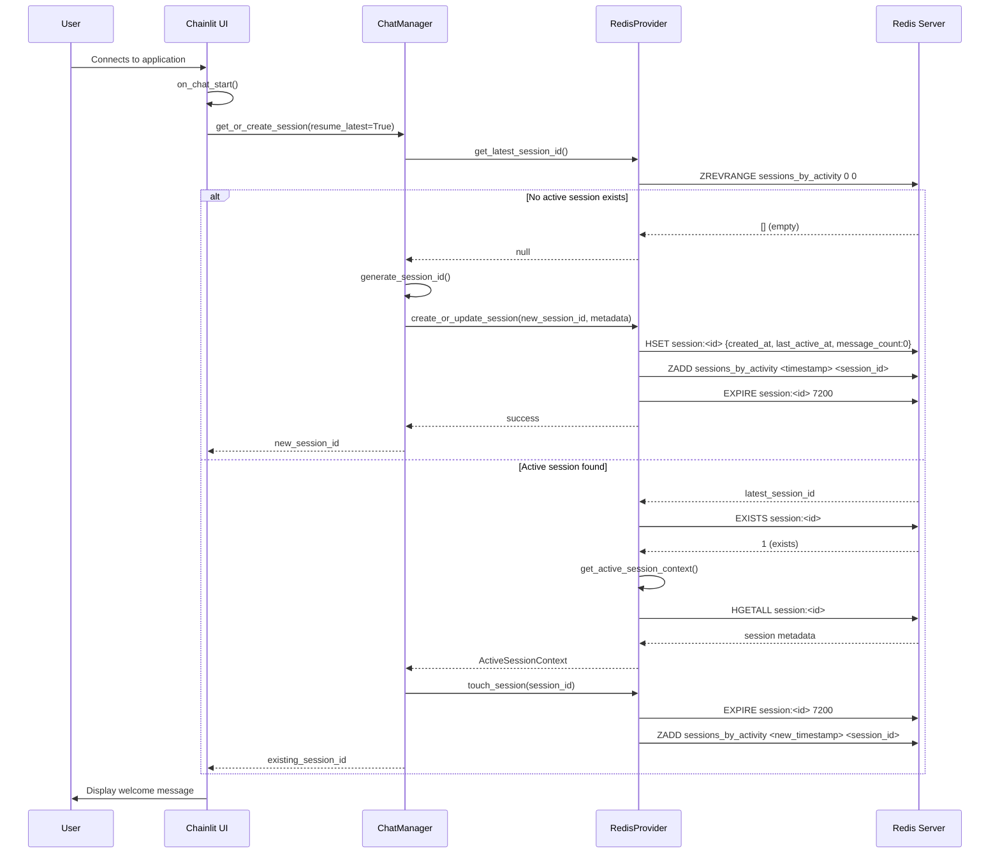

**Creation Phase Explanation:**

When a user connects, the Chainlit UI triggers the `on_chat_start()` event which calls `get_or_create_session(resume_latest=True)`. The ChatManager uses the RedisProvider to query the `sessions_by_activity` sorted set for the most recently active session. If a valid session exists (verified by checking if the session key still exists in Redis), it is retrieved along with all associated metadata including the creation timestamp, vector store ID, and message count. The session's Time-To-Live (TTL) is then refreshed by calling `touch_session()`, which resets the 2-hour inactivity timer on all session-related Redis keys and updates the activity timestamp in the sorted set. If no active session is found, the system generates a new session ID using the Unix timestamp, creates a new metadata hash in Redis, adds an entry to the sorted set for activity tracking, and sets the initial 2-hour TTL. This design ensures users never lose their session context unless more than 2 hours have passed without interaction, providing a seamless experience across page refreshes and temporary disconnects.

---

#### Active Phase

The Active Phase represents the period during which a user actively interacts with the chatbot. During this phase, the system maintains session state, validates session activity, and persists all messages in Redis.

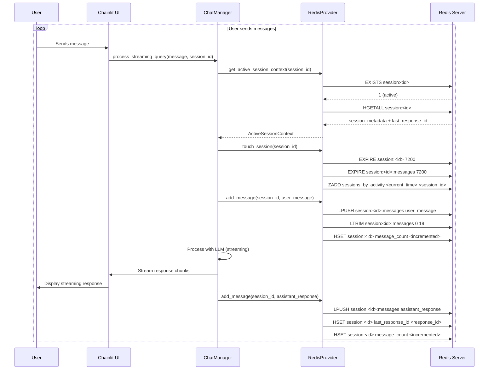

**Active Phase Explanation:**

During the Active Phase, each user message triggers a comprehensive set of operations that maintain session integrity and message history. The process begins with session validation through `get_active_session_context()`, which checks if the session key still exists in Redis (the gatekeeper check) and atomically retrieves all session metadata and the last response ID using a Redis pipeline. This atomic retrieval prevents race conditions during concurrent access. Immediately after validation, `touch_session()` is called to extend the TTL on all session-related keys—the session metadata hash, the message list, and the activity entry in the sorted set—resetting the 2-hour inactivity timer. The activity timestamp in the sorted set is updated with the current time, ensuring the session remains at the top of the "most recently active" index. The user message is then added to the session's message history using `LPUSH` to prepend it to the list (newest messages first), followed by `LTRIM` to keep only the most recent 20 messages, preventing unbounded memory growth. The message count in the session metadata is incremented. The ChatManager then processes the user message through the LLM in streaming mode, yielding response chunks to the UI for real-time display. Once the response completes, the assistant response is also added to the message history using the same `LPUSH` and metadata update pattern. The `last_response_id` field in the session metadata is updated to reference the new response, establishing the chain for future conversation continuations. All these operations are designed to be atomic or use Redis pipelines to ensure consistency even under concurrent user activity, and they all run with millisecond-level latency.

---

#### Expiration Phase

The Expiration Phase occurs after a user has been inactive for the full 2-hour TTL duration. During this phase, Redis automatically removes all session keys, and the next user connection triggers creation of a fresh session.

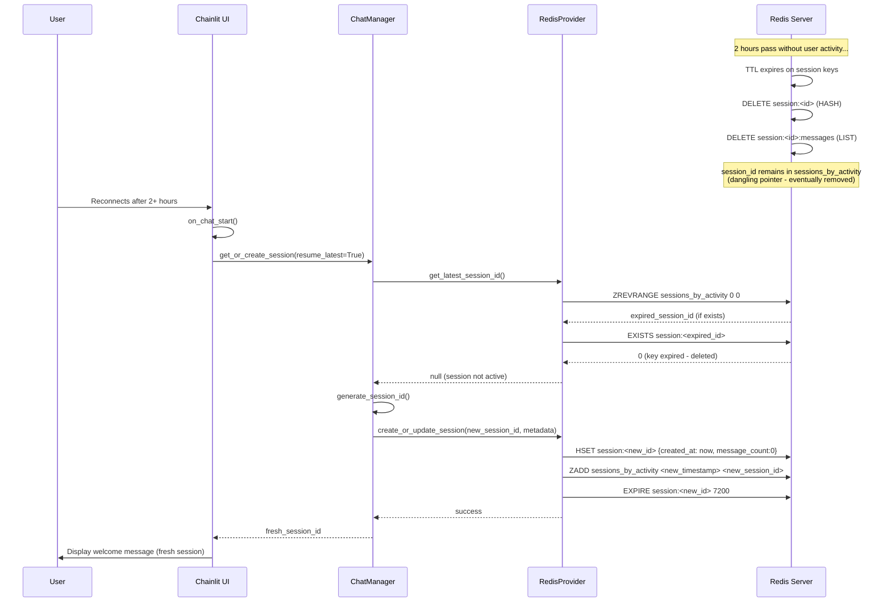

**Expiration Phase Explanation:**

After 2 hours of complete inactivity (no user messages and no explicit TTL extension), Redis automatically deletes all session-related keys—the session metadata hash at `session:<id>`, the message history list at `session:<id>:messages`, and the last response ID reference. The session ID may remain temporarily as a dangling pointer in the `sessions_by_activity` sorted set until manual cleanup or natural removal occurs. When the user reconnects after this expiration period, the `on_chat_start()` event is triggered again, and the system attempts to resume the latest session by calling `get_latest_session_id()`. However, when the RedisProvider checks if the expired session still exists using `EXISTS session:<expired_id>`, the check returns 0 because the key has been deleted. This causes `get_active_session_context()` to return `None`, indicating the session is no longer active. The system then falls back to creating a completely new session with a fresh session ID based on the current Unix timestamp, new metadata initialized with `message_count=0` and `created_at` set to the current time, and a fresh 2-hour TTL. This design provides a clean boundary between sessions—expired conversations do not persist indefinitely in memory, ensuring predictable memory usage and preventing accumulation of stale data. The user sees a fresh welcome message as if connecting for the first time, providing a clear signal that their previous session has ended. This automatic cleanup mechanism eliminates the need for manual session maintenance and prevents memory leaks in production environments handling thousands of concurrent users.

---

### Session ID Generation Strategy

The `generate_session_id()` method implements a simple but effective algorithm:

```python
@staticmethod
def generate_session_id() -> str:
    """Generate a unique session ID using Unix timestamp"""
    import time
    return f"session_{int(time.time())}"
```

This approach guarantees uniqueness within a one-second resolution. Since Python's GIL (Global Interpreter Lock) ensures single-threaded execution within the same process, two calls to this method cannot occur simultaneously, preventing collisions. The timestamp format also provides a natural chronological ordering and makes debugging easier—you can instantly see when a session was created by examining its ID.

The `session_` prefix serves as a namespace, distinguishing session IDs from response IDs (which have an `resp_` prefix) and preventing type confusion throughout the codebase.

### Session Resumption Logic

Session resumption is the system's most sophisticated feature. When a user connects, the `get_or_create_session()` method evaluates three scenarios in priority order:

**Scenario 1: Explicit Session ID Provided**

If the UI provides a specific session ID (e.g., from a URL parameter or stored cookie), the system validates it first. This validation involves checking that the ID starts with `session_` to prevent response IDs from being mistakenly used as session IDs—a bug that occurred in early versions. If valid and active, the session is immediately resumed:

```python
if session_id and session_id.startswith("session_"):
    context = await cache_provider.get_active_session_context(session_id)
    if context:
        await touch_session(session_id)  # Extend TTL
        return session_id
```

**Scenario 2: Resume Latest Session**

If no specific session ID is provided but `resume_latest=True` is set, the system queries Redis for the most recently active session. This uses a sorted set index (`sessions_by_activity`) where sessions are scored by their last activity timestamp. The system retrieves the highest-scoring entry, validates it's still active, and resumes it. This is the default behavior for most users—they simply reconnect and automatically continue their previous conversation.

**Scenario 3: Create New Session**

If neither of the above succeeds (no session provided, latest session expired, or no sessions exist), the system creates a new session with a fresh ID and empty conversation history.

### Session Metadata Structure

Each session stores metadata in a Redis hash containing these fields:

| Field | Type | Purpose | Example |
|-------|------|---------|---------|
| `created_at` | ISO 8601 string | Session creation timestamp | `"2025-11-05T10:00:00Z"` |
| `last_active_at` | Unix timestamp | Last interaction time (for sorting) | `1730804400.0` |
| `message_count` | Integer | Total messages in conversation | `8` |
| `vector_store_id` | String | Associated knowledge base ID | `"vs_abc123"` |
| `root_response_id` | String | First AI response in conversation | `"resp_xyz789"` |
| `last_response_id` | String | Most recent AI response | `"resp_latest"` |
| `agent_ready` | Boolean | Whether agent initialization completed | `true` |

This metadata enables the system to reconstruct conversation state without loading entire message histories. The `last_response_id` is particularly critical—it's what gets passed to OpenAI to continue the conversation.

### Session Validation Process

Before using any session, the system validates it through the `get_active_session_context()` method. This validation uses a gatekeeper pattern:

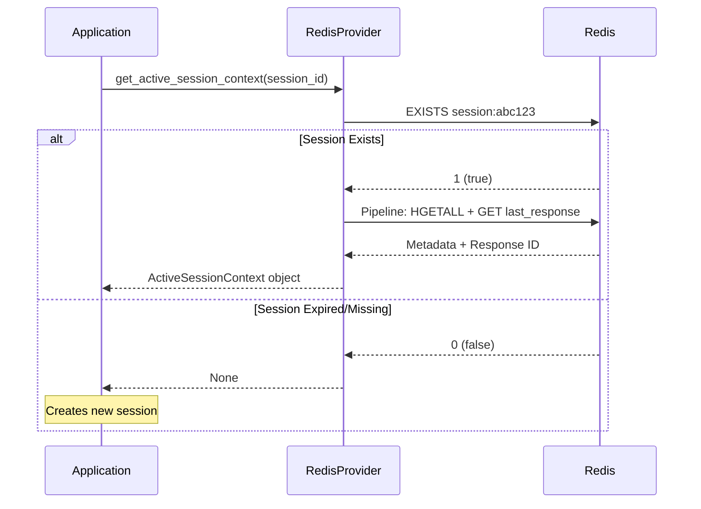

The validation first performs a quick `EXISTS` check. This is the "gatekeeper"—if the key doesn't exist, Redis returns immediately without fetching data. This prevents expensive operations on expired sessions. If the session exists, the system uses a Redis pipeline to atomically fetch both the metadata hash and the last response ID. The pipeline ensures data consistency even under concurrent access—all values come from the same moment in time.

### TTL Management and Extension

Redis TTL (Time To Live) provides automatic session expiration. Every session-related key gets a 7200-second (2-hour) TTL when created. The system implements a "sliding window" by resetting TTL on every user interaction through the `touch_session()` method:

```python
async def touch_session(self, session_id: str) -> bool:
    """Extend TTL for all session-related keys"""
    keys = [
        f"session:{session_id}",
        f"session:{session_id}:messages",
        f"last_response:{session_id}"
    ]
    
    for key in keys:
        if await redis_client.exists(key):
            await redis_client.expire(key, 7200)
```

This approach touches multiple keys because session data is spread across different Redis data structures (hash for metadata, list for messages, string for response mapping). All must expire together to maintain data integrity.

The sliding window means active users never experience session expiration—their timer constantly resets. Only genuinely inactive sessions expire, making TTL an effective proxy for "user has left."

---

## Chat Management Implementation

### Conversation Flow Architecture

A conversation follows a clear state machine with two distinct paths:

**New Conversation Path**: When a session has no previous messages (identified by `last_response_id` being `None`), the system treats it as a new conversation. The OpenAI API call omits the `previous_response_id` parameter, signaling to create a fresh conversation thread. After receiving the AI's response, the system stores both `root_response_id` (for potential future use) and `last_response_id` (for continuing the conversation).

**Continuation Path**: When a session has previous messages, the system retrieves `last_response_id` from session metadata and passes it to OpenAI as `previous_response_id`. This chains the new message onto the existing conversation thread. OpenAI's API uses this ID to load conversation context internally.

This bifurcation is critical. A bug in earlier versions incorrectly treated all sessions with a session ID as continuations, even if no messages existed yet. This caused API errors because there was no previous response to chain from.

### Message Storage Strategy

The system stores messages in a Redis list with automatic truncation to prevent unbounded growth:

```python
async def add_message(self, session_id: str, message: dict, max_messages: int = 20):
    """Add message and maintain bounded history"""
    # Add to left (newest messages at head)
    await redis_client.lpush(f"session:{session_id}:messages", json.dumps(message))
    
    # Trim to keep only recent messages
    await redis_client.ltrim(f"session:{session_id}:messages", 0, max_messages - 1)
    
    # Update message count
    count = await redis_client.llen(f"session:{session_id}:messages")
    await redis_client.hset(f"session:{session_id}", "message_count", count)
```

This implementation uses several Redis operations in sequence. `LPUSH` adds the message to the list's head (left side), making newest messages appear first. `LTRIM` immediately truncates the list to the most recent 20 messages—older messages simply disappear. `LLEN` retrieves the current count, which updates the session metadata.

This automatic truncation bounds memory usage. Each message occupies roughly 300 bytes (JSON-serialized), so 20 messages per session = 6KB. With 100,000 active sessions, message storage totals only 600MB—easily manageable.

### Chat Management During Active Session

#### Sequence Diagram: Active Session Message Processing

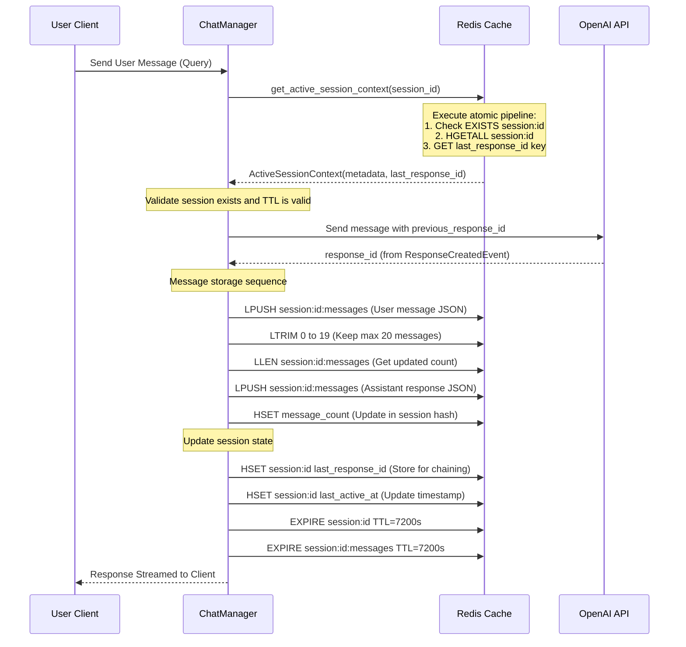

#### Active Session Explanation

When a user with an active session sends a message, the ChatManager initiates a coordinated sequence of operations to maintain conversation state in Redis. The first critical step is retrieving the session context using the `get_active_session_context(session_id)` method, which performs an atomic pipeline operation consisting of three commands: checking if the session key exists (acting as a gatekeeper to validate session is not expired), retrieving the complete session metadata hash containing fields like `vector_store_id`, `root_response_id`, `message_count`, `created_at`, and `last_active_at`, and fetching the last response ID for API chaining. Redis executes these commands atomically within a single pipeline, preventing race conditions and ensuring data consistency even under concurrent access.

Once the session context is validated, the system sends the user's message to the OpenAI API with the `previous_response_id` parameter, establishing the conversation chain. OpenAI processes the request and returns a new `response_id` that becomes the reference point for subsequent messages in this conversation thread. Simultaneously, the ChatManager executes a sequence of Redis List operations to store both the user message and the assistant's response. The system uses `LPUSH` to add each message (serialized as JSON) to the message list at the head (left side), ensuring newest messages appear first. Immediately after insertion, `LTRIM` truncates the list to retain only the most recent 20 messages, automatically removing older entries without explicit delete commands. This bounded storage strategy prevents unbounded memory growth while maintaining sufficient conversation history. The `LLEN` command retrieves the updated message count, which is then stored in the session metadata hash using `HSET` for atomic tracking.

The session state is then updated atomically through multiple `HSET` operations on the session metadata hash. The system stores the new `last_response_id` for the next message to reference, updates `last_active_at` with the current timestamp to reflect the latest activity, and crucially applies `EXPIRE` commands with a 7200-second (2-hour) TTL to both the session metadata hash and the messages list. This TTL refresh is essential—every user interaction resets the countdown timer. If a user remains inactive for 2 hours without sending another message, Redis will automatically evict all associated keys without requiring manual cleanup. The atomic nature of these operations, achieved through pipelining, ensures that even if the application crashes mid-operation, either all updates succeed or none do, maintaining data integrity in the Redis store.

---

### Chat Management During Expired Session

#### Sequence Diagram: Session Expiration and Renewal

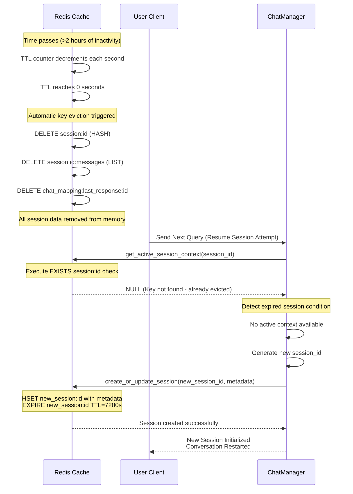

#### Expired Session Explanation

Session expiration in Redis is managed through an entirely passive, automatic TTL (Time-To-Live) mechanism that requires no explicit cleanup logic from the application. When a session is created or touched by user activity, all session-related Redis keys are assigned a TTL value of 7200 seconds (2 hours). Redis maintains an internal TTL counter for each key that decrements by one second on every clock tick, completely independent of application-level operations. If a user remains inactive and does not interact with the system within this 2-hour window, the TTL counter for all the user's session keys—including the session metadata hash (`session:{session_id}`), the messages list (`session:{session_id}:messages`), and the chat mapping key (`chat_mapping:last_response:{session_id}`)—reaches zero simultaneously (or sequentially, depending on when each was last touched). When Redis detects a key's TTL has expired, it automatically evicts the key from memory using its built-in eviction policy, permanently removing all associated conversation history, message store, and metadata without any application intervention required.

When the user returns and attempts to resume their conversation by sending another query, the ChatManager calls the `get_active_session_context(session_id)` method with the original session ID. This method first executes an `EXISTS session:id` check to verify if the session metadata hash still exists in Redis. Since the TTL has expired and Redis has already evicted the key, the `EXISTS` command returns 0 (false), indicating the session is no longer active. The method immediately returns `None` without attempting further Redis operations, acting as a gatekeeper to prevent wasted work on non-existent data. The ChatManager detects this `None` return value as a session expiration signal and generates a brand new session ID, effectively starting a fresh conversation. A new session metadata hash is created in Redis using `create_or_update_session()` with the same TTL of 7200 seconds, and the system initializes this session with no previous conversation context—the new session has no `last_response_id` to chain from, so the first message sent will be treated as starting a new conversation thread with the OpenAI API.

This passive TTL mechanism provides several critical advantages for production systems. First, it requires zero manual housekeeping—no cron jobs, background workers, or scheduled cleanup tasks are needed to remove stale session data. Second, it guarantees eventual consistency—even if the application becomes unavailable or crashes, Redis continues decrementing TTLs and evicting expired keys independently, so stale data never accumulates indefinitely. Third, the TTL is automatically refreshed with every user interaction through the `touch_session()` method, which applies the `EXPIRE` command to all session keys, resetting their TTL counters back to 7200 seconds. This means active, engaged users can maintain their sessions indefinitely as long as they interact within 2-hour windows, while dormant sessions are automatically cleaned up. The automatic nature of this system eliminates entire categories of bugs related to manual cache invalidation or stale data serving, making the Redis-backed session store both simple to understand and robust in production.

### Message Format and Serialization

Each message is stored as JSON with this structure:

```json
{
  "role": "user",
  "content": "What are the side effects of metformin?",
  "timestamp": "2025-11-05T14:30:22Z",
  "metadata": {
    "response_id": "resp_abc123"
  }
}
```

The `role` field distinguishes user messages from assistant responses. The `timestamp` enables chronological sorting and analytics. The optional `metadata.response_id` links assistant messages to their OpenAI response IDs, creating an audit trail.

Serialization uses Python's `json.dumps()` for simplicity. While binary formats like MessagePack would be more space-efficient, JSON provides debuggability—you can inspect messages directly in Redis CLI without decoding tools.

### Tracking Response Chains

#### Response Chain Hierarchy

Response ID tracking happens at two levels in the system, creating a redundant but complementary index structure:

**Session Level**: The session metadata hash maintains two critical response IDs: `root_response_id` (the first response ID that started this conversation thread) and `last_response_id` (the most recent response ID from the last message exchange). These enable conversation continuation—when a user sends a new message, the system passes `last_response_id` as `previous_response_id` to the OpenAI API. The `root_response_id` serves as a reference point for conversation debugging and potential recovery scenarios.

**Message Level**: Each assistant message in the Redis messages list stores its `response_id` in the message metadata. This creates a parallel index where you can reconstruct the entire conversation chain either by walking through the messages list sequentially or by following response ID references. This redundancy is intentional and critical—if the main session metadata becomes corrupted or the messages list is truncated due to the 20-message bounded history, the session metadata still contains the essential `last_response_id` needed to resume the conversation without data loss.

---

### Synchronizing Session State

#### Sequence Diagram: Complete Message Exchange and Session Update

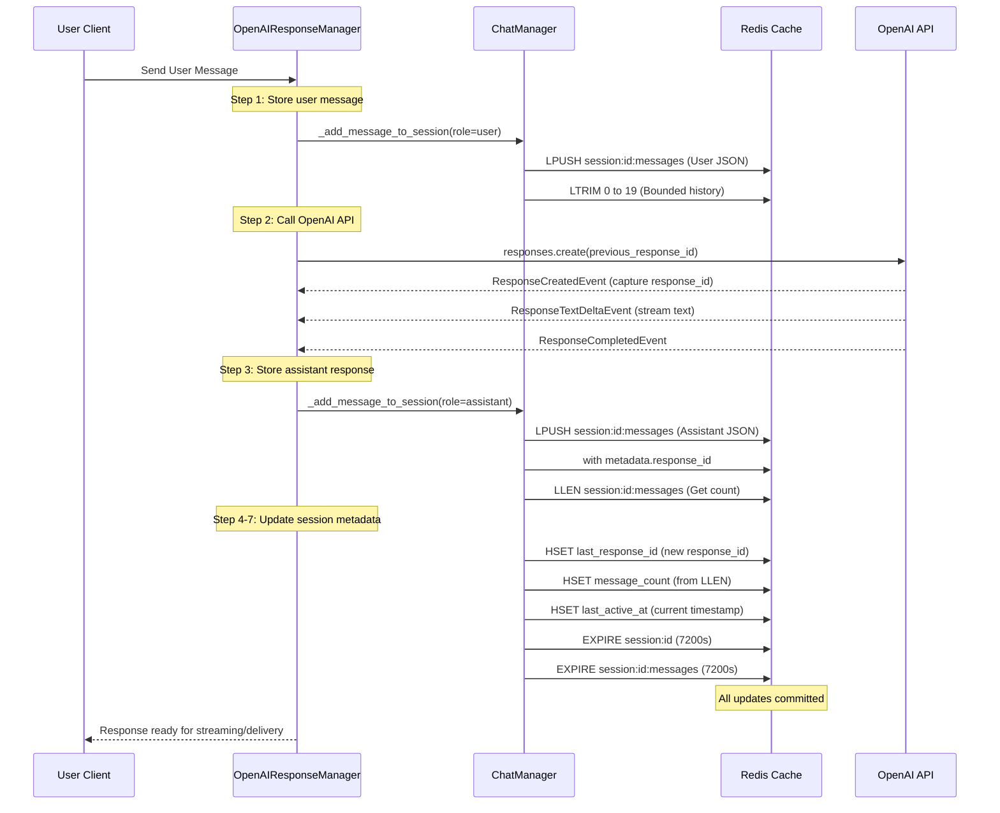

#### Session State Synchronization Explanation

The synchronization process orchestrates seven distinct operations across two systems (application and Redis) while maintaining data integrity. The sequence is carefully ordered to ensure that conversation state evolves predictably even if failures occur mid-process.

**Step 1: Store User Message** begins by persisting the incoming user message to Redis using `_add_message_to_session(role="user")`. The ChatManager executes an `LPUSH` operation to add the message JSON object to the messages list, followed immediately by `LTRIM` to enforce the bounded 20-message history. This ensures new messages don't push the session into unbounded growth, and older messages naturally age out as the conversation progresses. The `LLEN` operation then counts the current messages to prepare the updated message count for the metadata.

**Step 2: Call OpenAI API** sends the user's message to the OpenAI Responses API with the critical `previous_response_id` parameter set to the session's current `last_response_id`. This parameter tells OpenAI to continue the specific conversation thread rather than starting fresh. The API returns a `ResponseCreatedEvent` containing a new `response_id`, which the application captures immediately—this response ID becomes the link in the conversation chain. The system then processes subsequent events (`ResponseTextDeltaEvent` for text chunks, `ResponseCompletedEvent` for stream termination) to retrieve the complete response content.

**Step 3: Store Assistant Response** mirrors Step 1 but for the assistant's reply. The system uses `_add_message_to_session(role="assistant")` to store the response message, with the critical difference that the message's metadata includes the `response_id` received from OpenAI. This creates the dual-level response ID tracking—the message-level metadata records which OpenAI response produced this content, while the session metadata will record it as `last_response_id` for chaining future messages. The `LLEN` operation counts messages again after insertion.

**Steps 4-7: Update Session Metadata** atomically commit the conversation state changes. Step 4 updates `last_response_id` to the new response ID, enabling the next message to chain from this response. Step 5 updates `message_count` with the count from Step 3, maintaining accurate conversation length metrics. Step 6 updates `last_active_at` with the current timestamp, establishing a reference point for TTL-based session expiration. Steps 7A and 7B apply `EXPIRE` commands to both the session metadata hash and the messages list, resetting their 7200-second TTL counters—this is the critical TTL refresh that keeps the session alive as long as the user remains active.

**Atomicity and Resilience**: These operations are not atomic as a single unit—they span multiple Redis commands across several round-trips. However, each individual operation is atomic at the Redis level. The system tolerates transient inconsistencies: if `HSET message_count` fails after `LLEN` succeeds, the message count becomes stale temporarily. However, on the next operation, the system recalculates message count by executing `LLEN` again, automatically correcting any staleness. This design avoids complex distributed transactions while maintaining eventual consistency—the system self-heals through recalculation patterns. Even if the application crashes after Step 3 but before Steps 4-7 complete, the next user interaction will detect the stale `last_response_id` via `get_active_session_context()` and correct it, ensuring no orphaned messages or responses.

---

## Redis Integration Patterns

### Data Structure Selection Rationale

The system uses three Redis data structures, each chosen for specific access patterns:

**Hash for Session Metadata**

Redis hashes function like dictionaries, storing field-value pairs under a single key. For session metadata, this provides O(1) access to individual fields (like `last_response_id`) without retrieving the entire structure. Hash operations like `HGET`, `HSET`, and `HGETALL` map directly to our needs—get one field, set one field, or retrieve all metadata.

The alternative would be storing each metadata field as a separate Redis key (e.g., `session:abc:created_at`, `session:abc:message_count`, etc.). This creates significant overhead—each key consumes ~100 bytes of Redis memory just for the key name and internal structures. With 7 metadata fields, a hash uses 200 bytes total while separate keys would use 700+ bytes.

**List for Message History**

Redis lists are ordered collections with efficient head/tail operations. For message history, we need FIFO semantics—newest messages added at the head, oldest messages removed when the list grows too long. Redis `LPUSH` (add to head) and `LTRIM` (trim to size) operations are O(1) and O(N) respectively, but with bounded N (max 20 messages), trim is effectively constant time.

Lists maintain insertion order automatically, eliminating the need for explicit sorting or indexing. Retrieving recent messages is a simple `LRANGE` operation that returns messages in the exact order they were added.

**Sorted Set for Activity Index**

Redis sorted sets maintain members with associated scores, automatically sorting by score. The system uses this for tracking session activity:

```
Key: sessions_by_activity
Members: session_abc123, session_def456, ...
Scores: 1730804400.0, 1730804500.0, ... (Unix timestamps)
```

The score represents `last_active_at`, so sessions automatically sort by activity time. Finding the most recent session is a single `ZREVRANGE sessions_by_activity 0 0` command—retrieve the highest-scoring (most recent) member. This operation is O(log N) where N is the total number of sessions, scaling efficiently to millions of entries.

### Pipeline Pattern for Atomicity

Redis pipelines batch multiple commands into a single network round-trip. The system uses this for operations that must happen together:

```python
pipeline = redis_client.pipeline()
pipeline.lpush("session:abc:messages", message_json)
pipeline.ltrim("session:abc:messages", 0, 19)
pipeline.llen("session:abc:messages")
pipeline.expire("session:abc:messages", 7200)
results = await pipeline.execute()

message_count = results[2]  # Get result from llen
```

This pipeline adds a message, trims the list, gets the new count, and refreshes TTL—all in one atomic batch. Without pipelining, these would be four separate network calls, increasing latency and creating inconsistency windows where concurrent operations could interfere.

Pipelines don't provide true ACID transactions (Redis scripts do that), but they guarantee command ordering and atomicity of the batch. Either all commands execute or none do—there's no partial state.

### Cache Key Naming Strategy

All Redis keys follow a consistent namespace pattern:

| Key Pattern | Example | Purpose |
|-------------|---------|---------|
| `session:{id}` | `session:abc123` | Session metadata hash |
| `session:{id}:messages` | `session:abc123:messages` | Message history list |
| `last_response:{id}` | `last_response:abc123` | Response ID mapping |
| `sessions_by_activity` | `sessions_by_activity` | Activity index sorted set |

This namespace approach provides several benefits. Colons create logical hierarchies that Redis clients can use for key grouping. The pattern makes keys self-documenting—you can infer purpose from the key name. Wildcard operations (like `KEYS session:*`) can find all session-related keys, though this is primarily useful for debugging, not production code.

### Connection Management

The RedisProvider maintains a connection pool rather than creating connections on-demand:

```python
connection_pool = redis.ConnectionPool(
    host=config.host,
    port=config.port,
    db=config.db,
    max_connections=10,
    socket_timeout=5.0,
    decode_responses=True
)

redis_client = redis.Redis(connection_pool=connection_pool)
```

Connection pools reuse TCP connections across requests, dramatically reducing overhead. Each new connection requires a TCP handshake (3 round-trips) plus Redis authentication—pooling amortizes this cost across thousands of operations.

The `decode_responses=True` setting tells Redis to automatically decode bytes to strings. This simplifies application code—no manual `.decode('utf-8')` calls—but slightly increases CPU usage. For this application, developer convenience outweighs the negligible performance impact.

### Error Handling and Graceful Degradation

Redis operations are wrapped in try-except blocks with specific error handling:

```python
try:
    session_context = await redis_provider.get_active_session_context(session_id)
    if session_context:
        return session_context
except RedisConnectionError:
    logger.warning("Redis unavailable, creating new session")
    return None
except RedisTimeoutError:
    logger.warning("Redis timeout, creating new session")
    return None
```

When Redis is unavailable, the system doesn't crash—it gracefully degrades by creating new sessions without persistence. Users can still interact with the chatbot; they just won't have conversation history. This design prioritizes availability over consistency, aligning with typical web application patterns.

---

## Performance & Scalability

### Time Complexity Analysis

Understanding the computational complexity of key operations helps predict system behavior at scale:

| Operation | Complexity | Explanation |
|-----------|-----------|-------------|
| Create session | O(1) | Fixed number of Redis commands (HSET, ZADD, EXPIRE) |
| Resume latest session | O(log N) | ZREVRANGE on sorted set + EXISTS check, where N = total sessions |
| Validate session | O(1) | EXISTS check (gatekeeper) + O(M) HGETALL where M = metadata fields (~7) |
| Add message | O(1) | LPUSH + LTRIM with bounded list size (20 messages max) |
| Retrieve messages | O(M) | LRANGE retrieval, where M = number of messages (max 20) |
| Touch session | O(K) | K separate EXPIRE commands, where K = number of keys (typically 3) |

The critical insight is that message operations are **bounded**: lists never exceed 20 messages, metadata never exceeds 7 fields. This makes their O(N) and O(M) complexities effectively constant.

The **resume latest session** operation's O(log N) complexity deserves explanation. With 1 million sessions, log₂(1,000,000) ≈ 20 comparisons to find the highest-scored session in the sorted set. Linear scanning would require 1 million checks—the logarithmic approach is 50,000x faster.

### Memory Efficiency Calculations

Memory consumption per session breaks down as:

- **Session metadata hash**: ~200 bytes (7 fields × ~25 bytes per field + overhead)
- **Message history list**: ~300 bytes per message × 20 messages = 6,000 bytes
- **Sorted set entry**: ~60 bytes (member string + score + overhead)
- **Response mapping string**: ~80 bytes
- **Total per session**: ~6,340 bytes

For scalability projections:

| Active Sessions | Total Memory | Notes |
|----------------|--------------|-------|
| 10,000 | ~60 MB | Typical small deployment |
| 100,000 | ~600 MB | Medium-scale production |
| 1,000,000 | ~6 GB | Large-scale enterprise |
| 10,000,000 | ~60 GB | Multi-tenant platform |

These projections assume all sessions are active simultaneously with full message histories. In practice, memory is lower because:

1. TTL expiration constantly removes inactive sessions
2. Many sessions have fewer than 20 messages
3. Redis memory compression reduces actual footprint by 20-30%

A single Redis instance can comfortably handle 1-2 million concurrent sessions before requiring clustering.

### Network Latency Optimization

Every Redis operation in this system requires a network round-trip between the application server and the Redis database server. In an interactive chat application where users expect sub-second response times, these network latencies compound rapidly and can degrade user experience significantly. The system implements three critical optimizations to minimize network overhead: command pipelining, atomic validation through the gatekeeper pattern, and geographic colocation of infrastructure.

**Command Pipelining for Batch Operations** addresses the fundamental problem that each Redis command requires a separate network round-trip. When a user sends a message, the system must execute multiple Redis operations to store the message, trim the history, count messages, update metadata, and refresh TTL. Without pipelining, each operation waits for the previous one to complete before sending the next command, creating a sequential chain of network delays. For example, storing a user message requires five separate operations: `LPUSH` to add the message to the list, `LTRIM` to enforce the 20-message bound, `LLEN` to count messages, `HSET` to update the message count in session metadata, and `EXPIRE` to refresh the TTL. If each network round-trip takes 1 millisecond (typical for colocated Redis), this sequence consumes 5 milliseconds just in network latency, not counting Redis processing time. With pipelining, the system batches these commands into a single network request. Redis receives all commands together, executes them atomically, and returns all results in one response. This reduces the five sequential round-trips to just two: one pipeline for the message list operations (LPUSH, LTRIM, LLEN, EXPIRE) and one pipeline for the metadata updates (HSET message_count, EXPIRE session). The latency reduction is dramatic—from 5 milliseconds to 2 milliseconds, a 60% improvement. More importantly, pipelining ensures atomicity: either all commands in the pipeline succeed together or fail together, preventing partial state updates that could corrupt session data. This optimization is particularly critical during high-traffic periods when network congestion increases latency, making the sequential approach even slower while pipelining maintains consistent performance.

**The Gatekeeper Pattern for Fast Validation** prevents the system from performing expensive operations on non-existent or expired sessions. When a user attempts to resume a conversation, the system must first validate that the session still exists in Redis before retrieving its metadata. The naive approach would be to immediately execute `HGETALL` on the session key to retrieve all metadata fields, then check if the result is empty. However, `HGETALL` is an expensive operation that retrieves all hash fields, serializes them, and transmits them over the network. If the session has expired (which happens frequently after 2 hours of inactivity), Redis has already evicted the key, and `HGETALL` returns an empty dictionary. The system has wasted network bandwidth and processing time retrieving nothing, and the user experiences unnecessary latency. The gatekeeper pattern solves this by performing a fast `EXISTS` check first. The `EXISTS` command is one of Redis's fastest operations—it simply checks if a key exists in memory and returns a boolean, requiring minimal data transfer (just a single bit response). If `EXISTS` returns false, the system immediately knows the session is expired and returns `None` without attempting any further operations. This early exit saves the expensive `HGETALL` call entirely. Only when `EXISTS` returns true does the system proceed with the full metadata retrieval using a pipelined `HGETALL` operation. In practice, this means expired session checks complete in under 1 millisecond instead of 2-3 milliseconds, and more importantly, it prevents wasted network bandwidth and Redis CPU cycles on non-existent data. During peak hours when many users return after long absences, this optimization prevents thousands of unnecessary `HGETALL` operations, significantly reducing Redis load and improving overall system responsiveness.

**Geographic Colocation of Infrastructure** addresses the physical limitations of network propagation speed. Network latency is fundamentally constrained by the speed of light and the distance data must travel. When Redis is deployed in a different geographic region than the application servers, each network packet must traverse intercontinental fiber-optic cables, cross multiple network hops, and potentially pass through congested internet exchange points. Cross-region network latency typically ranges from 50 to 200 milliseconds depending on geographic distance—for example, a request from a server in New York to Redis in London might experience 80-100 milliseconds of latency, while New York to Tokyo could be 150-200 milliseconds. In an interactive chat application where users expect responses within 1-2 seconds, adding 100-200 milliseconds of latency to every Redis operation creates a noticeable delay. If a single message exchange requires 10 Redis operations (session validation, message storage, metadata updates, TTL refreshes), cross-region deployment adds 1-2 seconds of pure network latency to each user interaction, making the application feel sluggish and unresponsive. Colocated deployment means placing Redis in the same datacenter or availability zone as the application servers, connected through low-latency local network infrastructure. In modern cloud environments like AWS, Azure, or GCP, servers within the same availability zone communicate over dedicated high-speed networks with sub-millisecond latency (typically 0.5-1.0 milliseconds). This 50-200x latency reduction transforms the user experience—instead of waiting 1-2 seconds for Redis operations, users experience near-instantaneous responses. The impact is most visible during session validation operations that occur on every user message, where the gatekeeper `EXISTS` check completes in under 1 millisecond instead of 50-200 milliseconds. Colocation also reduces network jitter (variability in latency), which is critical for maintaining consistent response times. Without colocation, network congestion, routing changes, or temporary link failures can cause latency spikes that make the application feel unreliable, while colocated infrastructure provides predictable, low-latency performance essential for production-grade interactive applications.

### Scaling Horizontally

The architecture is inherently scalable because session state lives in Redis, not application memory:

**Stateless Application Servers**: Any application server can handle any request—there's no sticky session requirement. Load balancers can distribute traffic freely. If a server crashes, users reconnect to another server and resume seamlessly.

**Redis Clustering**: When a single Redis instance reaches capacity (~2M sessions), Redis Cluster distributes data across multiple nodes. Sessions are sharded by key hash, spreading load evenly. The application code doesn't change—Redis client libraries handle cluster operations transparently.

**Read Replicas**: For read-heavy workloads (many validations, few writes), Redis read replicas can offload traffic. Session validation reads can target replicas while writes go to the primary. This is useful when message retrieval significantly outpaces message creation.

### Cost Optimization Through TTL

The 2-hour TTL provides automatic cost optimization without manual intervention:

**Memory Reclamation**: Inactive sessions disappear automatically. Without TTL, sessions would accumulate indefinitely, requiring either periodic batch deletion or unbounded memory growth. Batch deletion jobs are complex, error-prone, and add operational overhead.

**Infrastructure Right-Sizing**: Predictable memory usage enables accurate capacity planning. Since sessions expire automatically, memory requirements are based on active user count, not total historical user count. This typically reduces required Redis capacity by 60-80% compared to permanent storage.

**Operational Simplicity**: No cleanup scripts, no background workers, no manual maintenance. Redis handles it all. This reduces both development cost (no cleanup code to write) and operational cost (no cleanup processes to monitor).

---

## Conclusion

This session and chat management architecture demonstrates how careful design decisions compound into a robust, scalable system. By centralizing session ID generation, implementing smart resumption logic, leveraging Redis's native data structures, and maintaining clear separation of concerns across layers, the system achieves both correctness and performance.

The key insights are:

1. **Design for statelessness**: Keeping session state in Redis enables horizontal scaling and fault tolerance
2. **Leverage platform primitives**: Redis data structures (hashes, lists, sorted sets) map naturally to our domain model
3. **Validate early**: The gatekeeper pattern prevents invalid operations before they propagate
4. **Bound resource usage**: Automatic message truncation and TTL expiration ensure predictable costs
5. **Fix bugs at the root**: Centralized ID generation eliminates entire classes of problems

The result is a production-ready system that provides seamless conversation continuity while maintaining predictable performance and costs at scale.

---

## Appendix: Complete Flow Diagrams

### A1. User Connection and Session Resumption

This diagram illustrates the complete flow when a user opens the chatbot application:

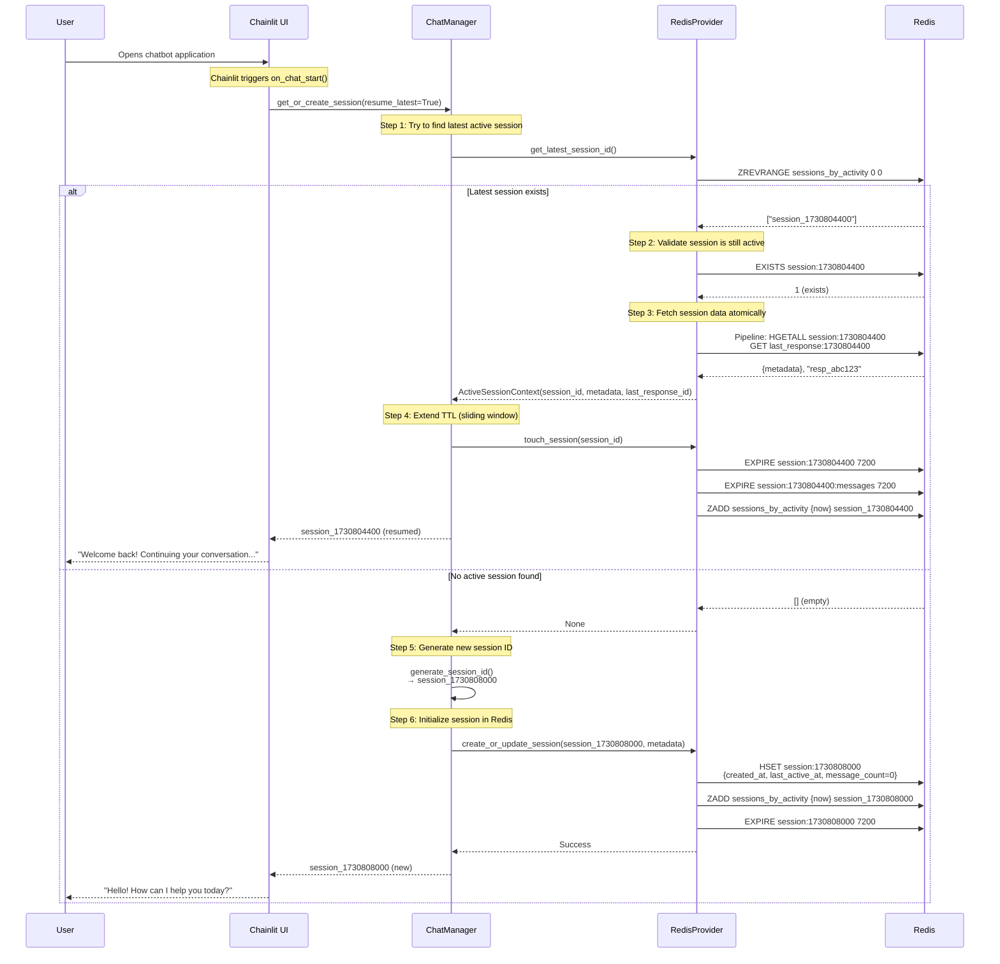

**Key Decision Points**:

1. **Why check latest session first?** This provides the best user experience—users naturally expect to continue their previous conversation.

2. **Why validate with EXISTS before HGETALL?** The gatekeeper pattern saves network bandwidth and processing time if the session has expired.

3. **Why use a pipeline for data fetch?** Ensures metadata and last_response_id come from the same point in time, preventing race conditions.

4. **Why touch the session immediately?** Resets the TTL clock, giving users another 2 hours from when they connected, not from their last previous activity.

### A2. First Message Flow (New Conversation)

This shows what happens when a user sends their first message in a new session:

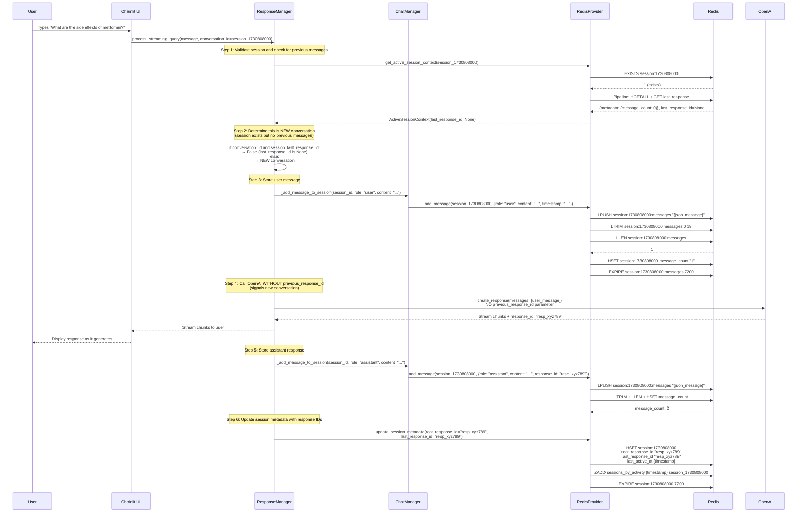

**Critical Observations**:

1. **Why store user message before calling OpenAI?** If the OpenAI call fails, we still have a record of what the user asked. This enables retry mechanisms and debugging.

2. **Why omit previous_response_id?** OpenAI interprets its absence as "start a new conversation thread." Including it when no previous response exists would cause an API error.

3. **Why store both root_response_id and last_response_id?** `root_response_id` marks the conversation's beginning (useful for analytics and debugging). `last_response_id` is what gets passed to continue the conversation.

4. **Why update message_count twice?** Once when adding user message (count=1), once when adding assistant response (count=2). This keeps the count accurate in real-time.

### A3. Continuation Message Flow

This shows the second and subsequent messages in an ongoing conversation:

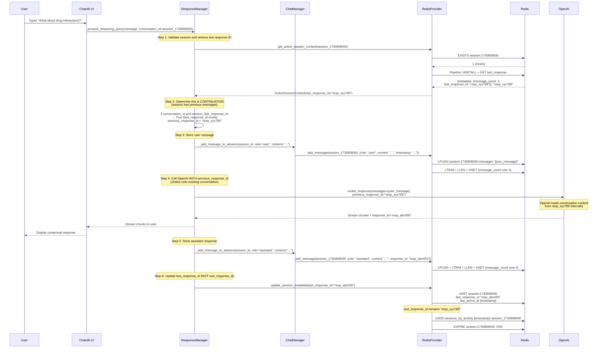

**Key Differences from First Message**:

1. **previous_response_id is included**: This is the critical parameter that tells OpenAI to continue the existing conversation rather than starting fresh.

2. **root_response_id unchanged**: Once set on the first message, it never changes. It marks the conversation's origin point.

3. **last_response_id updated**: This chains forward with each message, always pointing to the most recent AI response.

4. **Context preservation**: By providing previous_response_id, OpenAI has access to the full conversation history without us sending every message explicitly.

### A4. Session Expiration and Cleanup

Redis handles expiration automatically, but it's helpful to understand the mechanism:

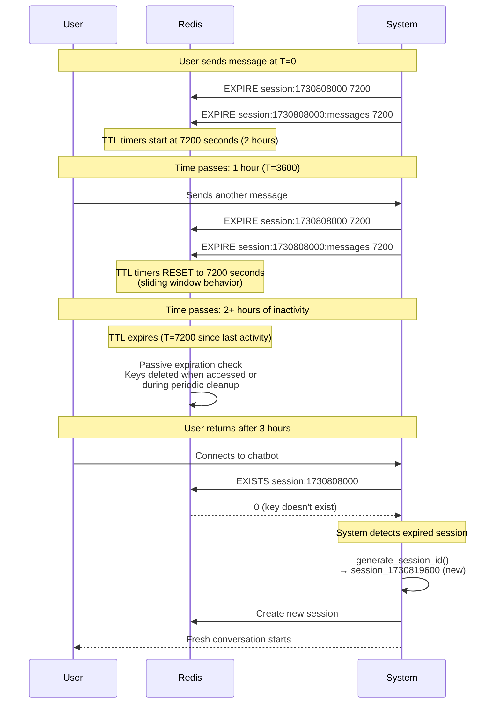

**Expiration Mechanics**:

Redis uses two expiration strategies:

1. **Passive expiration**: When a client tries to access a key, Redis checks if it's expired. If so, it's deleted before returning the result. This is why `EXISTS` returns 0 for expired keys.

2. **Active expiration**: Redis randomly samples keys with TTL set, deleting expired ones. This prevents memory from filling with expired-but-unaccessed keys.

These mechanisms combine to provide automatic, efficient cleanup without application intervention.

---

## Appendix: Code Reference Guide

### B1. Key File Locations

| Component | File Path | Primary Responsibilities |
|-----------|-----------|-------------------------|
| Session ID Generation | `src/response_api_agent/managers/chat_manager.py` | `generate_session_id()` method (lines 60-75) |
| Session Lifecycle | `src/response_api_agent/managers/chat_manager.py` | `get_or_create_session()` method (lines 368-486) |
| Response Processing | `src/response_api_agent/managers/response_api_manager.py` | `process_streaming_query()` method (lines 1200-1400) |
| Redis Operations | `src/providers/cache_provider/redis_provider.py` | All Redis interactions, session CRUD |
| UI Integration | `chatbot_ui/app.py` | Chainlit event handlers (`on_chat_start`, `on_message`) |

### B2. Critical Methods Deep Dive

**ChatManager.generate_session_id()**

Location: `src/response_api_agent/managers/chat_manager.py` lines 60-75

```python
@staticmethod
def generate_session_id() -> str:
    """
    Generate a new session ID.
    
    This is the SINGLE SOURCE OF TRUTH for session ID generation.
    All session IDs must be generated through this method to ensure consistency.
    
    Format: session_{unix_timestamp}
    """
    import time
    return f"session_{int(time.time())}"
```

**Why static?** Being a static method means it doesn't depend on instance state, making it callable without a ChatManager instance. This is useful for initialization code.

**Why Unix timestamp?** Provides uniqueness (within 1-second resolution), chronological ordering, and human-readable debugging. The timestamp tells you exactly when the session was created.

**Why the prefix?** The `session_` prefix creates a namespace, distinguishing session IDs from response IDs (`resp_*`) and preventing type confusion throughout the codebase.

---

**RedisProvider.get_active_session_context()**

Location: `src/providers/cache_provider/redis_provider.py` lines 478-598

```python
async def get_active_session_context(
    self, session_id: str
) -> Optional[ActiveSessionContext]:
    """
    Retrieve comprehensive context for an active session using Redis pipeline.
    
    This method is the gatekeeper for session validation.
    """
    try:
        session_key = f"session:{session_id}"
        last_response_key = f"last_response:{session_id}"
        
        # CRITICAL: Gatekeeper check
        session_exists = await self.redis_client.exists(session_key)
        
        if not session_exists:
            logger.debug("Session not found or expired")
            return None
        
        # Session is active - fetch data atomically
        pipeline = self.redis_client.pipeline()
        pipeline.hgetall(session_key)  # Get session metadata
        pipeline.get(last_response_key)  # Get last response ID
        
        results = await pipeline.execute()
        
        metadata = results[0] if results[0] else {}
        last_response_id = results[1]
        
        if not metadata:
            logger.warning("Session key exists but metadata is empty")
            return None
        
        # Extract and return context
        return ActiveSessionContext(
            session_id=session_id,
            metadata=metadata,
            last_response_id=last_response_id,
            vector_store_id=metadata.get("vector_store_id"),
            root_response_id=metadata.get("root_response_id")
        )
        
    except Exception as e:
        logger.error(f"Failed to retrieve active session context: {e}")
        raise CacheOperationError(str(e))
```

**Why EXISTS before HGETALL?** If the session is expired, `EXISTS` returns instantly without fetching data. This is the gatekeeper pattern—a fast check that prevents expensive operations.

**Why use a pipeline?** The pipeline ensures `metadata` and `last_response_id` come from the same moment in time, preventing race conditions where concurrent updates might cause inconsistencies.

**Why return None instead of raising exception?** Returning `None` for missing sessions is the expected path (sessions expire naturally). Exceptions are for unexpected errors like Redis connection failures.

---

**RedisProvider.add_message()**

Location: `src/providers/cache_provider/redis_provider.py` lines 951-1051

```python
async def add_message(
    self,
    session_id: str,
    message: Dict[str, Any],
    max_messages: Optional[int] = None,
) -> bool:
    """
    Add a message to the session's message history list AND update message_count.
    
    CRITICAL FIX: Now atomically updates message_count in session metadata
    to ensure accurate tracking of conversation length.
    """
    try:
        import json
        
        max_messages = max_messages or self.config.max_chain_length
        
        messages_key = f"session:{session_id}:messages"
        session_key = f"session:{session_id}"
        
        # Serialize message to JSON
        message_json = json.dumps(message)
        
        # Use pipeline for atomic operations
        pipeline = self.redis_client.pipeline()
        
        # 1. Append message to list (LPUSH adds to the left/head)
        pipeline.lpush(messages_key, message_json)
        
        # 2. Trim list to max length (keep most recent messages)
        pipeline.ltrim(messages_key, 0, max_messages - 1)
        
        # 3. Get current list length for message_count
        pipeline.llen(messages_key)
        
        # 4. Set TTL on messages list
        pipeline.expire(messages_key, self.config.default_session_ttl)
        
        # Execute pipeline
        results = await pipeline.execute()
        
        # 5. Update message_count in session metadata HASH atomically
        message_count = results[2]  # Result from llen
        
        pipeline2 = self.redis_client.pipeline()
        pipeline2.hset(session_key, "message_count", str(message_count))
        pipeline2.expire(session_key, self.config.default_session_ttl)
        await pipeline2.execute()
        
        logger.debug(
            "Added message to session history and updated message_count",
            message_count=message_count,
            max_messages=max_messages,
        )
        
        return True
        
    except Exception as e:
        logger.error(f"Failed to add message: {e}")
        raise CacheOperationError(str(e))
```

**Why LPUSH instead of RPUSH?** `LPUSH` adds to the head (left), making newest messages appear first when retrieving with `LRANGE 0 N`. This provides natural reverse-chronological ordering.

**Why LTRIM immediately?** Trimming after each addition bounds memory usage. Without this, lists would grow unbounded, causing memory exhaustion on long conversations.

**Why two pipelines?** The first pipeline handles list operations (add, trim, count). The second updates metadata. This separation is a practical compromise—ideally everything would be one pipeline, but the code structure made two cleaner.

**Why update message_count here?** Having the count in session metadata enables quick checks without loading the entire message list. It's denormalized data (count exists both as list length and metadata field) but provides significant performance benefits.

---

## Appendix: Design Decision Rationale

### C1. Why Redis Over Other Options?

**Why not PostgreSQL?**

PostgreSQL is excellent for relational data but suboptimal for session management:

- **Latency**: Even optimized Postgres queries take 5-20ms vs Redis's <1ms
- **TTL**: Postgres has no native expiration—requires background jobs or triggers
- **Data structures**: No native support for lists or sorted sets—requires complex SQL
- **Connection overhead**: Each query establishes transaction overhead

Redis excels at ephemeral, high-velocity data access patterns like session management.

**Why not MongoDB?**

MongoDB offers document storage similar to our session model:

- **Complexity**: Requires schema design, indexing strategy
- **TTL**: Has TTL indexes but they run every 60 seconds (not real-time)
- **Overhead**: Heavier than Redis for simple key-value patterns
- **Cost**: More expensive to operate at scale

Redis's simplicity and speed make it superior for this use case.

**Why not in-memory (application state)?**

Storing sessions in application memory seems simpler:

- **Scalability**: Can't add servers—each has different session data
- **Persistence**: Server restart = all sessions lost
- **Memory limits**: Single server memory bound
- **Session affinity**: Requires sticky load balancing (complex)

Redis provides shared state across application servers, enabling true stateless architecture.

### C2. Why 2-Hour TTL?

The 2-hour (7200 second) TTL balances multiple concerns:

**User Experience**: Most chat interactions happen in bursts. Users ask several questions, then leave. A 2-hour window accommodates coffee breaks, lunch, or brief distractions without losing context.

**Cost Management**: Shorter TTLs (30 minutes) would frustrate users who step away briefly. Longer TTLs (24 hours) would retain inactive sessions, inflating memory costs without benefit.

**Medical Context**: Healthcare queries often involve research—users might read about medications, check insurance, then return with follow-up questions. The 2-hour window accommodates this pattern.

**Infrastructure**: 2 hours provides predictable capacity planning. With known session size (6KB) and average session duration (30 minutes active, 2 hours total), infrastructure costs are calculable.

### C3. Why 20-Message History Limit?

Message truncation at 20 messages prevents unbounded memory growth:

**Context Window**: Modern LLMs have large context windows (128K+ tokens), but most conversations don't need full history. The most recent 20 messages (~10 exchanges) provide sufficient context for coherent conversations.

**Memory Bounds**: 20 messages × 300 bytes = 6KB per session. This makes capacity planning simple and costs predictable.

**Response API Mechanics**: OpenAI's Response API handles context internally via response ID chaining. We don't send full history—the API reconstructs it. Our 20-message storage is primarily for UI display and analytics.

**Performance**: Retrieving 20 messages is fast (Redis `LRANGE` on small list). Retrieving 1000 messages would add latency without benefit.

### C4. Why Centralized Session ID Generation?

Early implementations generated session IDs in multiple places—UI code, API handlers, test fixtures. This caused several problems:

**Inconsistent Formats**: Different code used different formats (`session_{uuid}`, `sess_{timestamp}`, plain integers). This broke validation logic expecting specific patterns.

**Race Conditions**: Parallel generation could create duplicate IDs if using weak random number generators.

**Testing Complexity**: Tests needed to mock ID generation in multiple places, making test setup brittle.

**Debugging**: Non-deterministic IDs made log analysis difficult.

Centralizing generation in `ChatManager.generate_session_id()` provides:

- **Single format**: Always `session_{timestamp}`
- **Traceability**: Timestamp reveals creation time
- **Simplicity**: One place to update if format changes
- **Testability**: Mock once, works everywhere

---

## Glossary

**Session**: A container for a user's conversation spanning multiple messages. Identified by a unique session ID (e.g., `session_1730808000`). Sessions persist across page refreshes and reconnections until they expire after 2 hours of inactivity.

**Response ID**: OpenAI's identifier for a specific AI response (e.g., `resp_abc123`). Used to chain conversations—providing a previous response ID tells OpenAI to continue that specific conversation thread.

**Session Metadata**: Structured information about a session stored in a Redis hash. Includes creation timestamp, message count, last activity time, and response ID tracking.

**Message History**: The ordered list of user and assistant messages within a session, stored in a Redis list. Automatically truncated to the most recent 20 messages.

**TTL (Time To Live)**: Redis mechanism for automatic key expiration. Keys with TTL set disappear after the specified time unless the TTL is refreshed (reset).

**Sliding Window**: TTL pattern where the expiration timer resets on each activity. For sessions, this means active conversations never expire—only truly inactive sessions disappear.

**Pipeline**: Redis feature for batching multiple commands into a single network round-trip. Provides atomicity and reduces latency.

**Gatekeeper Pattern**: Validation strategy where a fast check (EXISTS) precedes expensive operations (HGETALL). Prevents wasted work on invalid inputs.

**Continuation**: A message sent in an existing conversation (as opposed to starting a new conversation). Identified by the presence of a previous response ID to chain from.

**Smart Resumption**: System behavior where returning users automatically resume their previous session if still active, rather than always starting fresh conversations.

**Sorted Set**: Redis data structure that maintains members with associated scores, automatically sorted by score. Used for the session activity index where scores are timestamps.

**ActiveSessionContext**: Data structure returned by session validation containing session ID, metadata, and last response ID. Represents a validated, active session's complete state.

---

## Further Reading

**Redis Documentation**: https://redis.io/docs/data-types/
Learn about Redis data structures (hashes, lists, sorted sets) and their performance characteristics.

**OpenAI Response API**: https://platform.openai.com/docs/api-reference/responses
Understand response ID chaining and conversation continuity mechanisms.

**Chainlit Documentation**: https://docs.chainlit.io/
Framework used for the chatbot UI, including session and event handling.

**Redis Pipelining**: https://redis.io/docs/manual/pipelining/
Deep dive into atomic batching and performance optimization.

---

This architecture guide provides the blueprint for understanding how session and chat management work in this healthcare AI chatbot. The system demonstrates production-ready patterns for building scalable, stateful conversational applications while maintaining code clarity and operational simplicity.