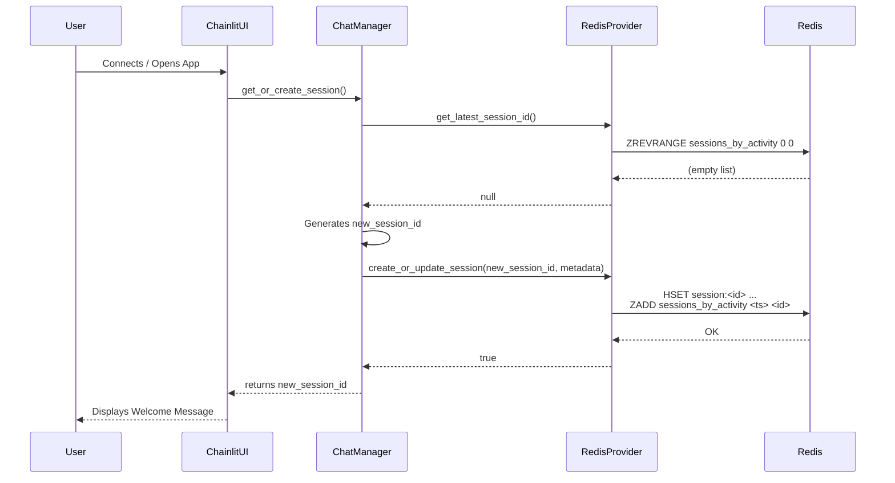
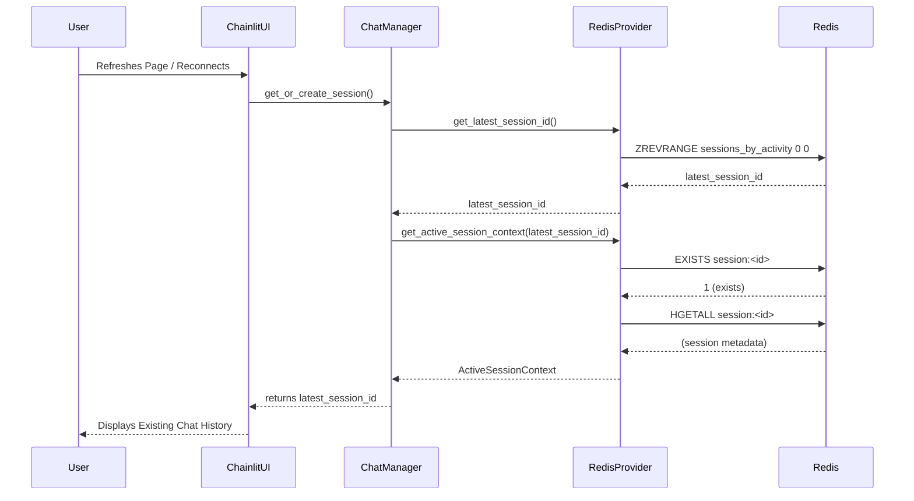
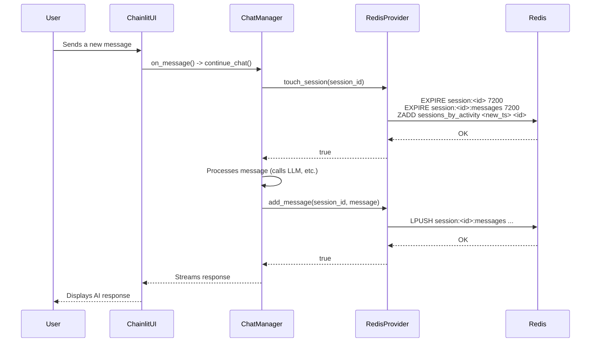

# Chatbot Optimization, Scalability, and Session Management

This document provides a comprehensive overview of the optimized and scalable Redis-based caching architecture used for session and chat management in the Asclepius Healthcare AI Assistant. The design is built for enterprise-grade performance, focusing on minimizing latency, reducing memory footprint, and ensuring a seamless user experience through intelligent session resumption.

## 1. Core Optimization & Scalability Principles

The architecture is founded on three core principles that ensure high performance and scalability:

### 1.1. Data Model Consolidation with Hashes

Instead of scattering session attributes across multiple top-level keys (which increases memory overhead and requires multiple network round-trips), all metadata for a single user session is stored in a single Redis **Hash**.

-   **Optimization**: This reduces key-related memory overhead and allows the application to retrieve all session metadata with a single, highly efficient `HGETALL` command. This is an O(1) operation (amortized), making it extremely fast regardless of the number of fields.

```python
# All session metadata is stored in a single hash
metadata = {
    "created_at": "2025-11-05T10:00:00Z",
    "last_active_at": 1762348351.750,  # Unix timestamp
    "agent_ready": True,
    "vector_store_id": "vs_abc123"
}

# Stored with a single command
await redis_client.hset("session:user_xyz", mapping=metadata)
```

### 1.2. Efficient Chat History with Lists

Conversation history is stored in a Redis **List**, which is the ideal data structure for time-series data like chat messages.

-   **Optimization**: Adding a new message is a highly efficient `LPUSH` operation with O(1) time complexity. The list is also automatically trimmed to a maximum length (e.g., 20 messages) on each push, which prevents unbounded memory growth and keeps conversation history management fast and predictable.

```python
# A new message is efficiently added to the head of the list
message_json = '{"role": "user", "content": "What is metformin?"}'
await redis_client.lpush("session:user_xyz:messages", message_json)

# The list is trimmed to keep only the most recent messages
await redis_client.ltrim("session:user_xyz:messages", 0, 19) # Keep 20 messages
```

### 1.3. Scalable Indexing with Sorted Sets

This is the cornerstone of the system's scalability. A single Redis **Sorted Set** (`sessions_by_activity`) serves as a global index for all active user sessions.

-   **Scalability**: The `session_id` is the member, and its `last_active_at` Unix timestamp is the score. This allows the system to find the most recently active session in **O(log N)** time, where N is the total number of sessions. This is exceptionally fast and scales effortlessly to millions of sessions, completely avoiding slow and costly `KEYS` or `SCAN` operations that would cripple a production system.

```python
# When a user sends a message, their session's score is updated
import time
current_timestamp = time.time()
await redis_client.zadd("sessions_by_activity", {"user_xyz": current_timestamp})

# Finding the most recent session is nearly instantaneous
latest_session_id = await redis_client.zrevrange("sessions_by_activity", 0, 0)
```

## 2. New Redis Key Schema

The optimized key schema is designed for clarity, efficiency, and to leverage the strengths of Redis data structures.

-   `session:<session_id>` (**HASH**): Stores all metadata for a session, such as creation date, last active time, and associated `vector_store_id`. This is the core session object.
-   `session:<session_id>:messages` (**LIST**): A capped list containing the recent conversation history for the session.
-   `sessions_by_activity` (**SORTED SET**): A single, global sorted set that indexes all session IDs by their last activity timestamp. This enables near-instant lookups of the most recent sessions.

## 3. Session and Chat Management Lifecycle

Hence, The system uses a smart session management lifecycle that provides a seamless experience for the user while efficiently managing resources.

### 3.1. Session Creation
A new session is created only when necessary:
1.  A user connects for the very first time.
2.  A returning user's previous session has expired due to inactivity (the default TTL is 2 hours).

When a new session is created, a new HASH is created for its metadata, and its ID is added to the `sessions_by_activity` sorted set.

### 3.2. Smart Session Resumption
When a user connects or refreshes the page, the system attempts to resume their previous session. This avoids re-initializing the knowledge base and preserves the conversation context.

1.  The `ChatManager` calls `get_latest_session_id()`, which queries the `sessions_by_activity` sorted set.
2.  If a recent session ID is found, `get_active_session_context()` is called to validate that the session's HASH key still exists in Redis (i.e., it has not expired).
3.  If the session is still active, it is seamlessly resumed. The user sees their previous conversation and can continue where they left off.

### 3.3. Session Activity & TTL Management
The default Time-To-Live (TTL) for a session is **2 hours**. This is a sliding window that resets with every user interaction.

1.  When a user sends a message, the `touch_session()` function is called.
2.  This function performs two critical actions:
    -   It resets the TTL on the session's HASH and message LIST keys back to 2 hours.
    -   It updates the `last_active_at` timestamp (the score) for the session in the `sessions_by_activity` sorted set, moving it to the top of the "most recent" list.

### 3.4. Session Expiration & Cleanup
If a user is inactive for the full 2-hour TTL period, Redis's built-in expiration mechanism automatically deletes the `session:<session_id>` HASH and `session:<session_id>:messages` LIST keys. This is a highly efficient, passive cleanup process that requires no application-level intervention.

The `session_id` will remain in the `sessions_by_activity` sorted set, but it becomes a "dangling pointer." The session resumption logic gracefully handles this: when it tries to validate the session, `get_active_session_context()` will find that the HASH key no longer exists and will trigger the creation of a new session.

## 4. Sequence Diagrams

The following diagrams visually explain the key workflows in the session management lifecycle.

### 4.1. New User / Session Creation Flow

This diagram shows the process when a new user connects, and no active session is available to be resumed.



### 4.2. Returning User / Session Resumption Flow

This diagram illustrates the "smart resumption" feature, where a returning user's active session is found and reused.



### 4.3. Message Handling and Session TTL Refresh Flow

This diagram shows how every user message updates the session's activity timestamp and extends its lifetime.


